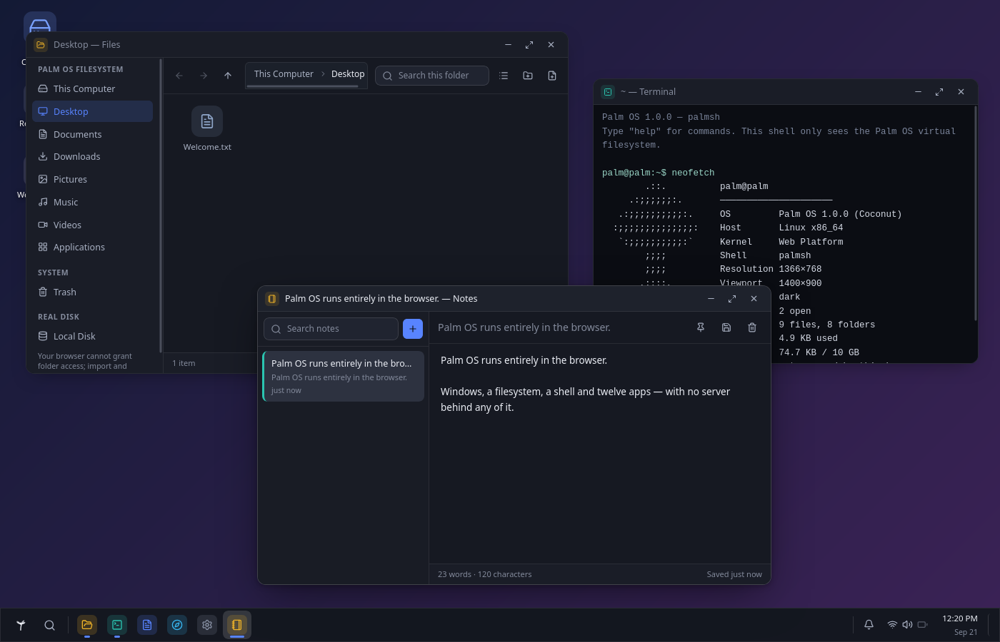

# Palm OS

Palm OS is a desktop environment that runs entirely in the browser. It includes a window manager, a virtual filesystem, a shell, twelve built-in apps, and a settings system. Everything you do is stored locally in IndexedDB and persists across reloads — there are no accounts, no telemetry, and no remote database.

The desktop itself is static client-side React. Alongside it runs a small Node companion service for two tasks the browser cannot handle on its own: proxying remote pages for the offline archiver, and routing subdomains so installed web applications run under isolated origins.



## Getting Started

You'll need Node 20 or newer.

```bash
npm install
npm run dev      # starts at http://localhost:5173
```

When you first open it, a brief welcome setup lets you pick a username, avatar, accent color, and wallpaper (you can skip it or rerun it anytime from Settings ▸ System).

Other useful scripts:

```bash
npm run build     # type-check and build to dist/
npm run preview   # preview production build on :4173
npm run serve     # run dist/ with the standalone server
npm run test      # run unit tests with Vitest
npm run test:e2e  # run Playwright end-to-end tests (Firefox)
npm run lint      # run oxlint
```

Before running end-to-end tests for the first time, install the Firefox browser binary:

```bash
npx playwright install firefox
```

## Features

### Window Manager and Shell
Windows support resizing from any edge or corner, minimize, maximize, restore, snapping (halves, quarters, fullscreen with live drag previews), and per-app remembered dimensions. Stacking order and focus are tracked across windows, and each app runs inside its own error boundary so a crash in one window does not take down the desktop. The taskbar can be placed on any screen edge, alongside a start menu, notification center, quick settings tray, and system search.

### Built-in Applications
Palm OS includes 12 built-in applications, each lazily loaded on demand: Files, Terminal, Text Editor, Browser, Notes, Calendar, Calculator, Image Viewer, Media Player, System Monitor, Settings, and an App Store.

### Palm Disk (Local Filesystem Access)
While the default virtual filesystem lives in IndexedDB, you can also mount a real folder from your computer using Files ▸ Palm Disk. This uses the File System Access API (Chromium browsers only).

Mounted folders are kept separate from the virtual filesystem to avoid confusion. You can browse, edit, save files, and create new files or directories, but Palm OS intentionally does not allow deleting, renaming, or moving anything on your actual disk.

### Web Applications and Origin Isolation
External websites can be added in two ways:

1. **Download (Offline Archiving):** Archives assets from a URL (via the App Store or `fetchsite <url>` in Terminal) and installs them with a service worker. The app runs from its own subdomain origin (like `http://app-<hash>.localhost:5173`), relying on the browser's same-origin policy to isolate third-party scripts from Palm OS storage and files. Network access is disabled by default, and archives report clear status indicators (`COMPLETE`, `PARTIAL`, `ONLINE_REQUIRED`, `FAILED`) based on what assets were captured.
2. **Add as app (Live Sites):** For sites that require authentication or block iframe embedding (such as Gmail or YouTube), Palm OS registers the site in your start menu and taskbar and opens it in a dedicated browser window, tracking when it opens and closes.

## Keyboard Shortcuts

| Shortcut | Action |
| --- | --- |
| `Ctrl + Space` | System search |
| `Super` | Start menu |
| `Alt + Tab` / `Alt + Shift + Tab` | Window switcher |
| `Ctrl + Alt + W` | Window switcher (fallback when host OS intercepts Alt+Tab) |
| `Alt + F4` | Close active window |
| `Super + ←` / `Super + →` | Snap left / right |
| `Super + ↑` / `Super + ↓` | Maximize / restore |
| `Ctrl + Alt + D` | Show desktop |
| `Ctrl + Alt + N` | Notification center |
| `Ctrl + Alt + A` | Quick settings |
| `Escape` | Close menus and active panels |
| `F2` / `Delete` / `Ctrl + C/X/V` | File rename, trash, clipboard actions |

Browser-reserved shortcuts (`Ctrl + T/W/N`, `F5`, `Ctrl + L`) are intentionally left alone so normal browser behavior isn't hijacked.

## Architecture

```
src/
├── core/              OS services, independent of any application
│   ├── app-manager/   Application registry, installation, and pin state
│   ├── calendar/      Shared event store
│   ├── clipboard/     Text and file clipboard
│   ├── filesystem/    Virtual filesystem, paths, MIME, seed, real-disk bridge
│   ├── keyboard/      Global shortcut manager
│   ├── notifications/ Notification center and toasts
│   ├── permissions/   Per-app capability grants
│   ├── search/        Pluggable system search providers
│   ├── settings/      User preferences, theming, and wallpaper catalogue
│   ├── shell/         Core shell state
│   ├── sites/         Web app archiving, URL rewriting, and origin bridge
│   ├── sound/         Synthesized UI audio
│   ├── storage/       IndexedDB wrapper and persistence
│   ├── window-manager/ Window state, focus, and snapping geometry
│   ├── backup.ts      Export and import with schema validation
│   ├── boot.ts        Startup sequence and initial filesystem seed
│   └── os.ts          OS API exposed to applications
├── desktop/           The shell: desktop canvas, taskbar, panels, window chrome
├── apps/              One directory per application (manifest + UI components)
├── components/        Reusable UI primitives and icon registry
├── hooks/             Cross-cutting React hooks
├── styles/            Design tokens and global styling
└── utils/             Formatting, color, and helper utilities
```

A strict rule governs the codebase: **nothing in `src/core/` imports from `src/apps/`**. Applications interact with the system exclusively through `core/os.ts`.

### Adding an Application

To add a new built-in application, define an app manifest:

```ts
// src/apps/Weather/manifest.ts
import { lazy } from 'react';
import type { AppDefinition } from '../../core/app-manager/types';

export const weatherApp: AppDefinition = {
  id: 'weather',
  name: 'Weather',
  description: 'Local conditions and forecast.',
  icon: 'Cloud',                    // icon name from components/icons.tsx
  color: '#38b6f0',
  category: 'Utilities',
  version: '1.0.0',
  developer: 'You',
  permissions: ['network', 'location'],
  window: { width: 520, height: 640 },
  component: lazy(() => import('./WeatherApp')),
};
```

Register it in `src/apps/index.ts`, and it immediately becomes available in the start menu, search, and App Store.

Within the app's UI component, `useOS()` exposes a permission-scoped OS handle:

```tsx
const { os } = useOS();

await os.fs.write('/Documents/report.txt', text);
await os.notify({ title: 'Saved', body: 'report.txt' });
await os.storage.set('lastCity', 'Lisbon');
os.window.setTitle('Weather — Lisbon');
```

## Storage and Privacy

All files, settings, notes, and local app state are stored directly in your browser's IndexedDB.

- **Backups:** Settings ▸ System exports your entire environment (files, settings, notes, installed app state) as a single JSON file and allows restoring from one.
- **Reset:** Settings ▸ Privacy ▸ Reset clears all local OS data.
- **Node companion service:** When downloading web apps for offline use, URLs are fetched through the local Node service. It does not log, retain, or forward requests, and sends no user cookies or credentials.
- **Local disk:** Palm OS cannot touch your computer's disk unless you explicitly select a directory via Palm Disk. Access is limited strictly to that chosen folder.

## Documentation

- [docs/ARCHITECTURE.md](docs/ARCHITECTURE.md) — System layers, state persistence, and VFS design
- [docs/SECURITY.md](docs/SECURITY.md) — Origin boundaries, sandbox behavior, and permission handling
- [docs/DEPLOYMENT.md](docs/DEPLOYMENT.md) — Wildcard DNS, certificates, and proxy setup for per-application origins
- [docs/LIMITATIONS.md](docs/LIMITATIONS.md) — Web platform constraints and how Palm OS handles them
- [docs/TESTING.md](docs/TESTING.md) — Test setup and testing conventions
- [docs/HOME-SERVER.md](docs/HOME-SERVER.md) — Design proposal for running Palm OS on an always-on home server

## License

MIT
